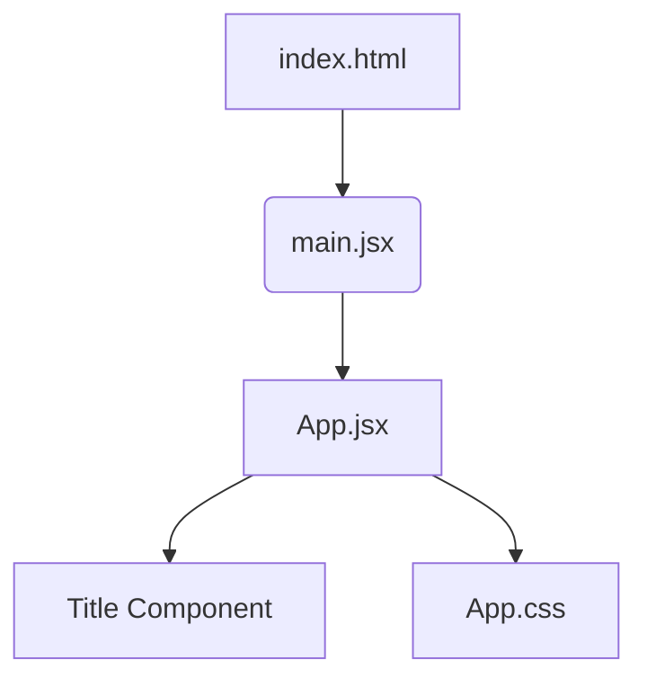
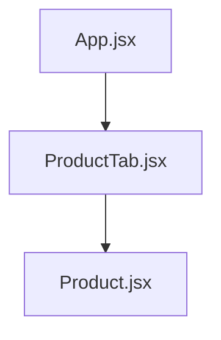

# React Fundamentals (Part 1)


A comprehensive guide to getting started with React, understanding components, JSX, and project architecture.


---


## 🚀 1. What is React?


React is a **JavaScript library** used for creating User Interfaces (UI).


- **The Core Idea:** React apps are built using **Components**.
- **The Process:** We render (invoke) components to display the UI.
- **Component Composition:** A component is a bundle of HTML, JavaScript, and CSS that acts as a reusable and independent piece of code.


---


## 🏗️ 2. Understanding JSX


**JSX** stands for **JavaScript Extension Syntax**. It allows us to write HTML-like code directly inside JavaScript.


- **Not Real JavaScript:** Browsers cannot read JSX natively.
- **The Transpiler:** A tool called **Babel** converts (transpiles) JSX into regular JavaScript.
- **Conversion Flow:** `JSX → Babel → JavaScript`


---


## 🛠️ 3. Setting Up the Local Environment


Modern React development favors **Vite** for its speed and efficiency.


### Initialization Command


Run the following command in your terminal:


```bash

npm create vite@latest

```


## 🗺️ 4. Project Structure & Application Flow


Understanding how files interact is key to mastering React.


### Folder Anatomy (`/src`)


- **index.html**  
  Entry point of the application. Contains `<div id="root"></div>`.


- **main.jsx**  
  Bridge between React and HTML. Renders the `App` component into the root div.


- **App.jsx**  
  Main component where high-level logic and layout live.


- **App.css**  
  Styles specific to the App component.


---


### Render Flow Diagram





## 🧩 5. Our First Component


In React, a **component is a JavaScript function that returns JSX**.  

Components help us break the UI into small, reusable pieces.


---


### Example (`App.jsx`)


```javascript
import "./App.css";
// A small, reusable component
function Title() {
  return <h1>I am Title</h1>;
}

// The main App component
function App() {
  return (
    <div>
      <h2>Hello!</h2>
      <Title /> {/* Nesting the Title component */}
    </div>
  );
}

export default App;
```


## 💡 Important Rules & Notes


- **File Organization**  

  Each component should ideally live in its own separate file.  

  This improves readability, reusability, and maintainability.


- **Single Root Rule**  

  A React component must return **one single root element**.

  ❌ **Incorrect**
  ```jsx
  return (
    <div>One</div>
    <div>Two</div>
  );
  ```
  ✅ **Correct**
  ```jsx
  return (
  <div>
    <div>One</div>
    <div>Two</div>
  </div>
  );
  ```


## 📦 6. Import & Export in React


React uses **ES Modules** to share components between files.


### Default Export

Used when a file exports **only one value**.


```js
// Title.jsx
export default Title;
```
```js
// App.jsx
import Title from "./Title.jsx";
```
✔ Can be imported with any name.


### Named Export


Used when exporting multiple values from a file.

```js
// Title.jsx
export function Title() {}
```
```js
import { Title } from "./Title.jsx";
```
✔ Name must match exactly.


Summary
- Default export → single value, flexible name
- Named export → multiple values, fixed names

Choose based on project structure and clarity.


----


## ✍️ 7. Writing Markup in JSX


JSX looks like HTML but follows JavaScript rules.


**JSX Rules**

**1.** Return a single root element

**2.** Close all tags

**3.** Use **camelCase** for attributes
```jsx

```

**🐫 camelCase in JSX**

JSX attributes become JavaScript object keys, so they follow JavaScript naming rules.


- JavaScript doesn’t allow dashes (-)
- Some words like class are reserved

**Examples**
- class → className
- stroke-width → strokeWidth


```jsx
<div className="container"></div>
```
👉 Rule: In JSX, use camelCase attribute names.


----


## 🧩 8. React Fragments


Fragments let you return multiple elements without adding extra DOM nodes.

**❌ Without Fragment (extra div added)**
```jsx
<div>
  <Title />
  <Title />
</div>
```
**✅ With Fragment (no extra DOM)**
```jsx
<>
  <Title />
  <Title />
</>
```
✔ Cleaner DOM

✔ Better performance


----


## 🧮 9. JSX with Curly Braces {}


Curly braces allow you to write JavaScript inside JSX.
```js
function Title() {
  let name = "Sachin";
  return <h1>Hello, {name.toUpperCase()}!</h1>;
}
```
✔ {} treats content as a JavaScript expression.


---


## 🧱 10. Structuring Components


In React, each component should live in its **own file**.  

This keeps the codebase clean and easy to scale.


### Example Structure


src/


├── Product.jsx


├── ProductTab.jsx


└── App.jsx


### Component Responsibilities


- **Product.jsx**  
  Represents a single product UI (title, description, etc.)


- **ProductTab.jsx**  
  Acts as a container that renders multiple `Product` components.


- **App.jsx**  
  Root component that renders `ProductTab`.


👉 You can find the full implementation inside the respective files.


### Component Flow





---


## 🎨 11. Styling Components


Styles are written in **separate CSS files** and imported into components.


### Styling Pattern


src/


├── Product.jsx


└── Product.css


- Styles related to a component live in its own CSS file.
- CSS is imported **at the top of the component file**.
- Use `className` instead of `class` in JSX.


**Example:**

```jsx

import "./Product.css";

```

✔ Keeps styles scoped and organized


✔ Improves maintainability


## 💡 Important Rules & Notes

**📁 File Organization**


Each component should ideally live in its own separate file.

This improves:


- Readability
- Reusability
- Maintainability


**🌳 Single Root Rule**


A React component must return one single root element (use a `<div>` or Fragment `<> </>` when needed).


> React Fundamentals (Part 1) completed successfully!

---

# 🔁 React Fundamentals (Part 2)

This section builds on the fundamentals by introducing Props, component communication, and real-world component structure.

## 🧾 12. React Props


**Props** are inputs passed to components, just like function arguments.
They allow components to receive **dynamic data.**

**Passing Props** (ProductTab.jsx)
```jsx
<Product title="Phone" price={500} />
```
**Receiving Props** (Product.jsx)
```jsx
function Product({ title, price }) {
  return (
    <div className="product">
      <h3>{title}</h3>
      <p>₹{price}</p>
    </div>
  );
}

export default Product;
```
✔ Props make components reusable

✔ Data flows parent → child

**🔢 Numbers in Props (Important)**

**Note:** In JSX, numbers must be passed using `{}`.
Values inside quotes are treated as strings.
```jsx
<Product price={500} />   // ✅ number
<Product price="500" />   // ❌ string
```

**⚠️ StrictMode Note (main.jsx)**

**Note:**
`<React.StrictMode>` in m`ain.jsx` intentionally renders components twice in development mode to detect side effects.
Because of this, `console.log()` may appear twice, but this does not happen in production.
```jsx
<React.StrictMode>
  <App />
</React.StrictMode>
```

