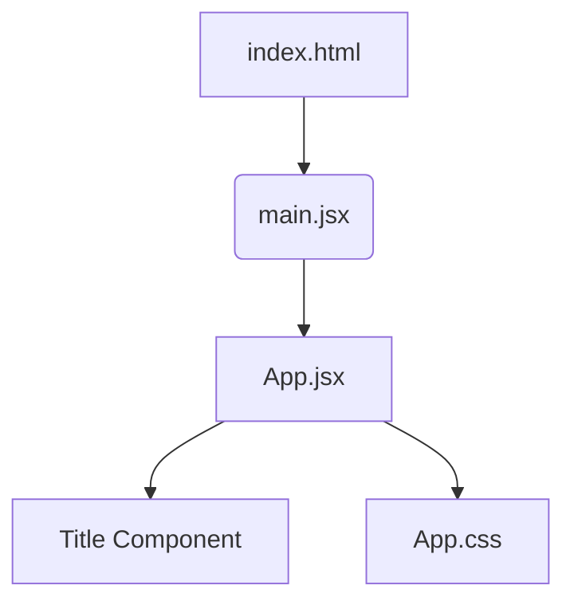

# React Fundamentals (Part 1)

A comprehensive guide to getting started with React, understanding components, JSX, and project architecture.

---

## 🚀 1. What is React?

React is a **JavaScript library** used for creating User Interfaces (UI).

- **The Core Idea:** React apps are built using **Components**.
- **The Process:** We render (invoke) components to display the UI.
- **Component Composition:** A component is a bundle of HTML, JavaScript, and CSS that acts as a reusable and independent piece of code.

---

## 🏗️ 2. Understanding JSX

**JSX** stands for **JavaScript Extension Syntax**. It allows us to write HTML-like code directly inside JavaScript.

- **Not Real JavaScript:** Browsers cannot read JSX natively.
- **The Transpiler:** A tool called **Babel** converts (transpiles) JSX into regular JavaScript.
- **Conversion Flow:** `JSX → Babel → JavaScript`

---

## 🛠️ 3. Setting Up the Local Environment

Modern React development favors **Vite** for its speed and efficiency.

### Initialization Command

Run the following command in your terminal:

```bash
npm create vite@latest
```

## 🗺️ 4. Project Structure & Application Flow

Understanding how files interact is key to mastering React.

### Folder Anatomy (`/src`)

- **index.html**  
  Entry point of the application. Contains `<div id="root"></div>`.

- **main.jsx**  
  Bridge between React and HTML. Renders the `App` component into the root div.

- **App.jsx**  
  Main component where high-level logic and layout live.

- **App.css**  
  Styles specific to the App component.

---

### Render Flow Diagram



## 🧩 5. Our First Component

In React, a **component is a JavaScript function that returns JSX**.  
Components help us break the UI into small, reusable pieces.

---

### Example (`App.jsx`)

```javascript
import "./App.css";

// A small, reusable component
function Title() {
  return <h1>I am Title</h1>;
}

// The main App component
function App() {
  return (
    <div>
      <h2>Hello!</h2>
      <Title /> {/* Nesting the Title component */}
    </div>
  );
}

export default App;
```

## 💡 Important Rules & Notes

- **File Organization**  
  Each component should ideally live in its own separate file.  
  This improves readability, reusability, and maintainability.

- **Single Root Rule**  
  A React component must return **one single root element**.

  ❌ **Incorrect**
  ```jsx
  return (
    <div>One</div>
    <div>Two</div>
  );
  ```
  ✅ **Correct**
  ```jsx
  return (
  <div>
    <div>One</div>
    <div>Two</div>
  </div>
  );
  ```

> This concludes the fundamentals of React. In the next section, we will explore component reusability using props and imports.
