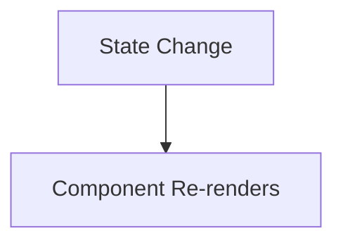

# ⚛️ React State & Hooks

This section focuses on **how React updates the UI**, why normal variables fail, and how **state & hooks** solve this problem.

---

## 🧠 Why State is Needed in React

A React component is **just a function**.

- Components render **only once**
- Variables inside components **do not trigger re-render**
- Updating variables only affects console / logic, **not the UI**

### ❌ Problem Example
```jsx
let count = 0;

function increment() {
  count++;
  console.log(count); // updates in console only
}
```
👉 UI does NOT update.

### ✅ What is State in React?

**State** is a built-in React object that:

- Stores component data
- Triggers re-render when updated
- Keeps UI in sync with data

When state changes → component re-renders automatically

### 🧪 Counter Example (Why Variables Fail)
```jsx
export default function Counter() {
  let count = 0;

  function incCount() {
    count += 1;
    console.log(count);
  }

  return (
    <div>
      <h3>Count = {count}</h3>
      <button onClick={incCount}>Increase</button>
    </div>
  );
}
```
❌ UI does NOT update

✔ Console logs change

### 🪝 Hooks in React

Hooks were introduced in React 16.8.

They allow you to:

- Use state
- Use other React features
- Without writing class components


### 🔹 useState() Hook

`useState` is a React Hook that lets you add a state variable to a functional component.

**Basic Syntax**
```jsx
const [state, setState] = useState(initialState);
```
**What `useState` Returns**

`useState` returns an array with exactly two values:

**1.** Current state value
- On the first render, it equals the initialState

**2.** Setter function
- Used to update the state
- Triggers a re-render of the component

### 📌 Example: Counter using useState
`Counter.jsx`
```jsx
import { useState } from "react";

export default function Counter() {
  const [count, setCount] = useState(0);

  const incCount = () => {
    setCount(count + 1);
  };

  return (
    <div>
      <h3>Count = {count}</h3>
      <button onClick={incCount}>Increase</button>
    </div>
  );
}
```

### ❤️ Activity: Create Like Button

In this activity, we built an interactive Like Button using React state.

**🪝 useState Hook**

`useState` is a React Hook that lets you add a state variable to your component.
When the state changes, React re-renders the UI automatically.

📂 File Location
- src/LikeButton.jsx
> You’ll find the complete implementation of this activity in the file above.

**🖼️ Output Preview**


### What is a Closure?

A **closure** is a feature in JavaScript where an inner function has access to variables of its outer (enclosing) function, even after the outer function has finished execution.

**Key Point**

In JavaScript, once a function completes execution, its local variables do not get destroyed if they are still being referenced by an inner function.

**Example**
```jsx
function outer() {
  let b = 10;

  function inner() {
    let a = 20;
    console.log(a + b);
  }

  return inner;
}

const fn = outer();
fn(); // 30
```
✔️ Here, `inner()` can access `b` even after `outer()` has finished — this is closure.

### 📌 React Re-render: How It Works
Important Rule

A React component **re-renders only when its state (or props) change**.

If there is **no change in state**, React will **not re-render** the component.

### Re-render Example Using useState
```jsx
export default function Counter() {
  const [count, setCount] = useState(0);

  console.log("Component re-executed");
  console.log("Count:", count);

  const incCount = () => {
    setCount(count + 1);
    console.log("New count value:", count);
  };

  return (
    <div>
      <p>Count = {count}</p>
      <button onClick={incCount}>Count</button>
    </div>
  );
}
```
**Explanation**

- Every time setCount updates the state
- The component function executes again
- UI updates with the new state value

### 📌 Callback in State Updater Function
When to Use **Callback**?

When the **new state depends on the previous state**, always use the callback form of `setState`.

**❌ Wrong Way**
```jsx
setCount(count + 1);
```
**✅ Correct Way (Callback)**
```jsx
setCount((currCount) => {
  return currCount + 1;
});
```
**Example: Multiple Updates**
```jsx
const incCount = () => {
  setCount((currCount) => currCount + 1);
  setCount((currCount) => currCount + 1);
};
```
✔️ This correctly increments count by **2**.

### ✨ Important Note on Re-rendering

- A React component re-renders only when the state value actually changes
- Setting the same value again will not trigger re-render

**Example**
```jsx
setCount(25);
```
If `count` is already `25`, React will **not re-render**.

### 🥸 Lazy Initialization in useState
**Rule**

When passing a function as the initial value to `useState`, do not call the function.

**❌ Wrong**
```js
useState(init());
```
➡️ Executes immediately on every render.

**✅ Right**
```js
useState(init);
```
➡️ React calls it only on the first render.

**Example**
```jsx
function init() {
  console.log("init was executed");
  return Math.random();
}

export default function Counter() {
  const [count, setCount] = useState(init);

  console.log("Component was rendered");

  const incCount = () => {
    setCount((currCount) => currCount + 1);
  };

  return <button onClick={incCount}>+</button>;
}
```
**Benefit**

- Called only once
- Improves performance
- Known as lazy initialization
