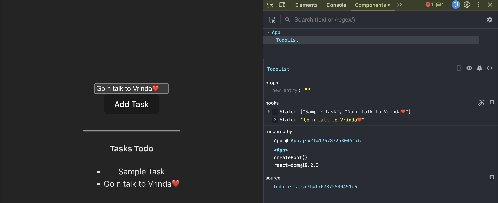

# ⚛️ React – Part 4

## Objects & Arrays in State

**Important Concept**

In JavaScript, **objects and arrays are reference types**.

- Changing a key or value **does not change the reference**
- Only the **inner data changes**
- React checks **reference change**, not value change

**Object Example**
```js
{ a: 2, b: 4 }  → change b to 3
```
✔ Value changes

❌ Object reference stays the same

**Array Example**
```js
[1, 2, 4] → change any value
```
✔ Value changes
❌ Array reference stays the same

### 🚨 Problem in React State
```jsx
let [moves, setMoves] = useState({ blue: 0, red: 0 });

let updateBlue = () => {
  moves.blue += 1;      // ❌ direct mutation
  setMoves(moves);     // ❌ same object reference
};
```
**Why This Is a Problem**

- State object is mutated directly
- Same reference is passed to `setMoves`
- React **does not detect change**
- Component **may not re-render**

### ✅ Correct Way: Using Spread Operator

To make React re-render with updated values, we use the **spread operator** while updating objects in state.
```jsx
setMoves({ ...moves, blue: moves.blue + 1 });
```
**What Happens Here**

- A **new copy of the object** is created
- A new object reference is passed to `setState`
- React detects the change and **re-renders the component**

### 🔁 When New State Depends on Previous State
**Important Rule**

When the **new state depends on the previous state**, always use the **callback form** of `setState`.

**✅ Correct Pattern (Callback Form)**
```jsx
let updateBlue = () => {
  setMoves((prevMoves) => {
    return { ...prevMoves, blue: prevMoves.blue + 1 };
  });
};
```
> You can find the **Ludo Board implementation code** here:
```jsx
src/LudoBoard.jsx
```
**🖼️ Reference Image**


### Activity: Create a Todo
> You can find the **Todo implementation code** here:
```jsx
src/TodoList.jsx
```
**🖼️ Reference Image**



---

### 🎯 Component Design & Architecture

The notes include breakdowns of:
- **Logical Components** (smart)
- **Presentational Components** (dumb)
- Functional Components
- Component Props
- Component State
- Component Events

### Component Breakdown Example
- `App`
- `Lottery` Component
- `Ticket` Component
- `TicketNum` Component

With properties like:
- Props: `ticket`, `num`, `winningSum`
- State: arrays such as `ticket[]`
- Events: `buyTicket()`

---

### 🎲 Lottery Example (Custom React Implementation)

A mini project exploring:
- generating random lottery tickets
- checking winning conditions
- lifting and sharing state between components
- using props for data flow
- passing functions as props (first-class JavaScript functions)
- rendering structured UI from arrays

---

### ⚙️ useEffect & Hooks Usage
Concepts practiced:
- When useEffect runs
- Dependency arrays
- Re-rendering behavior
- Real use cases

---

### 📋 Handling Arrays & Lists

Topics practiced (from lessons):
- Unique keys for list items
- Adding to an array
- Deleting from an array
- Updating one element in an array
- Updating all elements in array
- Marking items as completed (Todo Example)

---

### 🧾 Todo Project (Hands-on Practice)

The Todo implementation covers:
✔ Rendering a dynamic list  
✔ Adding & deleting tasks  
✔ Updating task status  
✔ Using arrays & immutability concepts  
✔ Connecting UI, logic & state  

### 📚 Props & Functions Understanding

Notes also cover:
- Passing data using props
- Passing functions as props
- First-class function behavior in JavaScript

### 🧱 Folder / File Structure (Summary)

All the relevant code and experiments can be found across files such as:
- `Lottery.jsx`
- `Lottery.css`
- `Ticket.jsx`
- `Ticket.css`
- `TicketNum.jsx`
- `TicketNum.css`
- `TodoList.jsx`